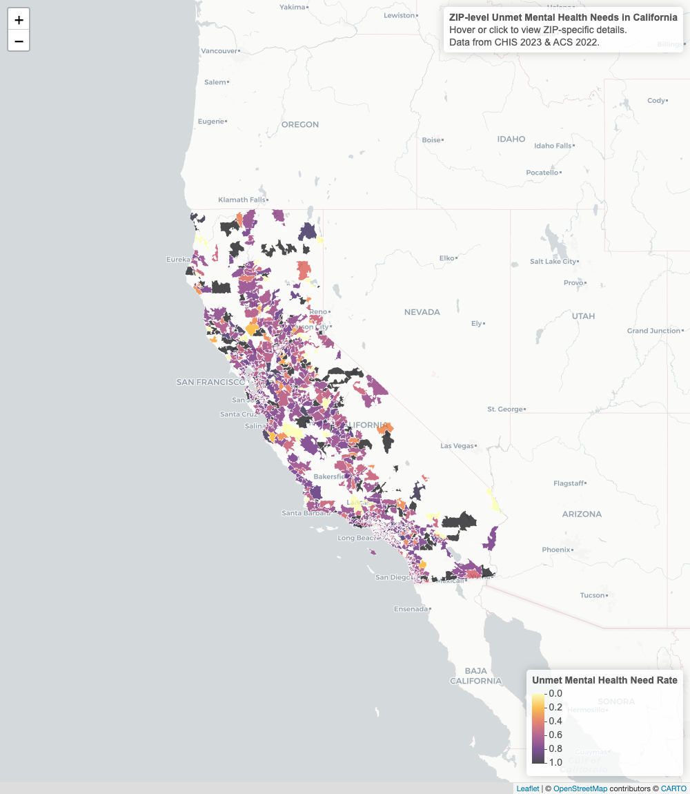

# Unmet Mental Health Needs in California

An interactive choropleth of unmet mental health need across California, mapped for 1,304 ZIP codes from the 2023 California Health Interview Survey (CHIS) and the 2022 American Community Survey (ACS). Each ZIP code is shaded by its unmet mental health need rate, from yellow near 0 to black near 1, so the areas where need most outruns care stand out at a glance.

**Explore the map at [subinna.com/SSEM](https://subinna.com/SSEM/).** Hover or click a ZIP code to see its unmet need rate. Zoom in to compare neighboring ZIP codes within a county or metro area.

## Data

- [California Health Interview Survey (CHIS) 2023](https://healthpolicy.ucla.edu/our-work/california-health-interview-survey-chis), UCLA Center for Health Policy Research. CHIS is the largest state health survey in the United States and provides the mental health need and service use measures behind the unmet need rate.
- [American Community Survey (ACS) 2022](https://www.census.gov/programs-surveys/acs), U.S. Census Bureau. ACS provides the ZIP-level population and demographic context.
- Basemap tiles from [CARTO](https://carto.com/) with data by [OpenStreetMap](https://www.openstreetmap.org/) contributors.

## Repository contents

| File | What it is |
|---|---|
| `index.html` | The full interactive map as one self-contained page, served by GitHub Pages at [subinna.com/SSEM](https://subinna.com/SSEM/) |
| `figures/map_overview.png` | The overview image shown above |

## Author

[Subin Na](https://subinna.com), PhD student in social welfare at the University of Pennsylvania.
